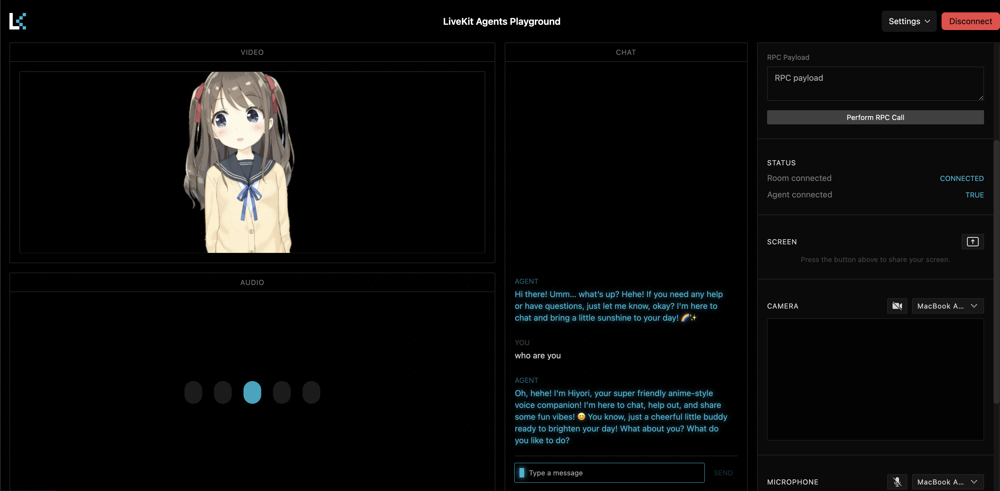

<div align="center"> <a name="readme-top"></a>

<picture>
  <source media="(prefers-color-scheme: dark)" srcset="/.github/banner_dark.png">
  <source media="(prefers-color-scheme: light)" srcset="/.github/banner_light.png">
  
</picture>

<br />

[](https://github.com/AlphaAvatar/AlphaAvatar/pulls)
[](https://github.com/AlphaAvatar/AlphaAvatar/commits/main)
[](https://github.com/AlphaAvatar/AlphaAvatar/blob/main/LICENSE)

[](https://GitHub.com/AlphaAvatar/AlphaAvatar/watchers/?WT.mc_id=academic-105485-koreyst)
[](https://GitHub.com/AlphaAvatar/AlphaAvatar/network/?WT.mc_id=academic-105485-koreyst)
[](https://GitHub.com/AlphaAvatar/AlphaAvatar/stargazers/?WT.mc_id=academic-105485-koreyst)


<h3 align="center">
Learnable, configurable, and pluggable Omni-Avatar Assistant for everyone
</h3>

<p align="center">
  <a href="ROADMAP.md">ROADMAP</a>
  |
  <a href="#">Demo</a>
  |
  <a href="#">HomePage</a>
  |
  <a href="#">Documents</a>
</p>

</div>

---

<h3>AlphaAvatar Plugins</h3>

<table>
<tr>
<td width="50%">
<h3>🧠 Memory</h3>
<p>
  
</p>
<p>Self-improving memory module for Omni-Avatar.</p>
<p>
<a href="https://github.com/AlphaAvatar/AlphaAvatar/blob/main/avatar-plugins/avatar-plugins-memory/README.md">README↗</a>
</p>
</td>
<td width="50%">
<h3>🧬 Persona</h3>
<p>
  
</p>
<p>Automatic extraction and real-time matching of user full modality persona.</p>
<p>
<a href="https://github.com/AlphaAvatar/AlphaAvatar/blob/main/avatar-plugins/avatar-plugins-persona/README.md">README↗</a>
</p>
</td>
</tr>

<tr>
<td width="50%">
<h3>💡 Reflection</h3>
<p>
  
</p>
<p>An Optimizer for Omni-Avatar that can automatically build an internal knowledge base for avatars.</p>
<p>
<a href="#">README↗</a>
</p>
</td>
<td width="50%">
<h3>🗺️ Planning</h3>
<p>
  
</p>
<p>Agents need to plan over a longer time frame to ensure that their actions are sequential and reliable.</p>
<p>
<a href="#">README↗</a>
</p>
</td>
</tr>

<tr>
<td width="50%">
<h3>🤖 Behavior</h3>
<p>
  
</p>
<p>Controls AlphaAvatar’s behavior logic and process flow.</p>
<p>
<a href="#">README↗</a>
</p>
</td>
<td width="50%">
<h3>😊 Virtual Character</h3>
<p>
  
</p>
<p>The real-time generated <b>virtual character</b> that visually represents the Avatar during interactions.</p>
<p>
<a href="https://github.com/AlphaAvatar/AlphaAvatar/blob/main/avatar-plugins/avatar-plugins-character/README.md">README↗</a>
</p>
</td>
</tr>

</table>

---

<h3>Tools Plugins</h3>

<table>
<tr>
<td width="50%">
<h3>🔍 DeepResearch</h3>
<p>
  
</p>
<p>Allow AlphaAvatar to <strong>access the network</strong> and perform single-step/multi-step inference through a separate Agent service to search for more accurate content.</p>
<p>
<a href="https://github.com/AlphaAvatar/AlphaAvatar/blob/main/avatar-plugins/avatar-plugins-deepresearch/README.md">README↗</a>
</p>
</td>
<td width="50%">
<h3>📖 RAG</h3>
<p>
  
</p>
<p>Allow AlphaAvatar to <strong>access documents</strong> (user-uploaded/generated by the Reflection module/URL access) to obtain document-related information.</p>
<p>
<a href="#">README↗</a>
</p>
</td>
</tr>

</table>

---

<h3>Docs and guides</h3>

<h4>Latest News 🔥</h4>

- [2026/01] We have released AlphaAvatar **version 0.3.0** to support DeepResearch by [tavily]((https://tavily.com)) API.
- [2025/12] We have released AlphaAvatar **version 0.2.0** to support [AIRI](https://github.com/moeru-ai/airi) live2d-based virtual character display.
- [2025/11] We have released AlphaAvatar **version 0.1.0** to support automatic memory extraction, automatic user persona extraction and matching.


<br/>

<h4>Installation ⚙️<h4>

Install **stable** AlphaAvatar version from PyPI:

```bash
uv venv .my-env --python 3.11
source .my-env/bin/activate
pip install alpha-avatar-agents
```

Install **latest** AlphaAvatar version from GitHub:

```bash
git clone --recurse-submodules https://github.com/AlphaAvatar/AlphaAvatar.git
cd AlphaAvatar

uv venv .venv --python 3.11
source .venv/bin/activate
uv sync --all-packages
```

<h4>Quick Start ⚡️<h4>

Start your agent in dev mode to connect it to LiveKit and make it available from anywhere on the internet:

```bash
export LIVEKIT_API_KEY=<your API Key>
export LIVEKIT_API_SECRET=<your API Secret>
export LIVEKIT_URL=<your LiveKit server URL>

export OPENAI_API_KEY=<your OpenAI API Key>

export QDRANT_URL='https://xxxxxx-xxxxx-xxxxx-xxxx-xxxxxxxxx.us-east.aws.cloud.qdrant.io:6333'
export QDRANT_API_KEY=<your QDRANT API Key>

# Optional
export TAVILY_API_KEY=<your TAVILY API Key>

alphaavatar download-files
alphaavatar dev examples/pipline_openai_airi.yaml
# or
alphaavatar dev examples/pipline_openai_tools.yaml
```

To see more supported modes, please refer to the [LiveKit doc](https://docs.livekit.io/agents/start/voice-ai/).

To see more examples, please refer to the [Examples README](https://github.com/AlphaAvatar/AlphaAvatar/blob/main/examples/README.md)

<h4>Usage 🚀</h4>

AlphaAvatar does not currently offer frontend support. Please start using it by visiting the [LiveKit playground](https://agents-playground.livekit.io/) link:


