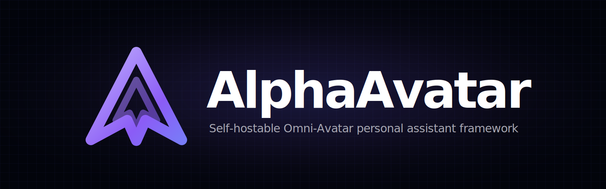
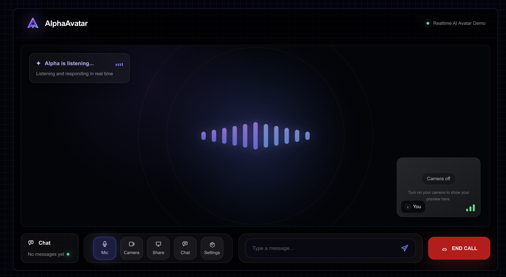

<div align="center"> <a name="readme-top"></a>

<picture>
  <source media="(prefers-color-scheme: dark)" srcset="./.github/banner_dark.svg">
  <source media="(prefers-color-scheme: light)" srcset="./.github/banner_light.svg">
  
</picture>

<br />

[](https://github.com/AlphaAvatar/AlphaAvatar/pulls)
[](https://github.com/AlphaAvatar/AlphaAvatar/commits/main)
[](https://github.com/AlphaAvatar/AlphaAvatar/blob/main/LICENSE)

[](https://GitHub.com/AlphaAvatar/AlphaAvatar/watchers/?WT.mc_id=academic-105485-koreyst)
[](https://GitHub.com/AlphaAvatar/AlphaAvatar/network/?WT.mc_id=academic-105485-koreyst)
[](https://GitHub.com/AlphaAvatar/AlphaAvatar/stargazers/?WT.mc_id=academic-105485-koreyst)


<h3 align="center">
Learnable, configurable, and pluggable Omni Personal Assistant for everyone
</h3>

<p align="center">
  <a href="ROADMAP.md">Roadmap</a>
  |
  <a href="https://www.alphaavatar.ai/demo">Demo</a>
  |
  <a href="https://www.alphaavatar.ai/">Homepage</a>
  |
  <a href="https://docs.alphaavatar.io/">Docs</a>
</p>

</div>

---

<h2>AlphaAvatar Introduction</h2>

AlphaAvatar is a **self-hostable Omni Personal Assistant framework** designed to evolve into an **intelligent personal butler** — a continuous, personalized, and proactive assistant that can remember, understand, plan, and act on behalf of the user.

It is built around a **plugin-based real-time Agent architecture**, combining:

- 🧠 **Memory** for long-term user, assistant, and tool interaction history
- 🧬 **Persona** for user understanding, identity continuity, and personalization
- 💡 **Reflection** for self-improvement and long-term behavioral adaptation
- 📅 **Planning** for task decomposition, reminders, and future-oriented actions
- ⚙️ **Behavior** for response style, workflow policy, and proactive assistance
- 🧰 **Tools** through MCP, RAG, DeepResearch, and external integrations
- 😊 **Virtual Character** for real-time voice/avatar interaction

✨ **Fully self-hostable and privacy-first** — AlphaAvatar can run locally or on your own infrastructure, giving you control over your data, memory, tools, and behavior.

---

<h3>What AlphaAvatar Is Designed For</h3>

<table>
<tr>
<td width="50%">

<h4>1️⃣ Personal Data & Life Metrics Management</h4>

- 📊 Track and analyze personal metrics such as health, fitness, sleep, and study progress
- 📈 Provide long-term insights and trend analysis
- 🎯 Suggest improvements based on historical patterns

</td>
<td width="50%">

<h4>2️⃣ Knowledge & Notes Management</h4>

- 📖 Organize personal notes, documents, and knowledge
- 🔍 Retrieve relevant information through RAG
- 🧠 Build a personal knowledge base over time

</td>
</tr>

<tr>
<td width="50%">

<h4>3️⃣ Task & Event Management</h4>

- 📅 Schedule tasks and reminders
- ⏰ Proactively notify based on context and priority
- 🔄 Break down long-term goals into actionable steps

</td>
<td width="50%">

<h4>4️⃣ Autonomous Planning & Execution</h4>

- 🧠 Plan multi-step workflows such as learning plans, projects, and research
- 🔧 Call tools automatically to complete tasks
- 📌 Maintain consistency across long time horizons

</td>
</tr>

<tr>
<td width="50%">

<h4>5️⃣ Personalized Companion & Context Awareness</h4>

- 🧬 Understand user preferences, habits, and personality
- 💬 Provide highly personalized responses
- 🤝 Maintain continuity across conversations and modalities

</td>
<td width="50%">

<h4>6️⃣ External World Interaction</h4>

- 🌐 Search, research, and summarize real-world information
- 🧰 Integrate with tools such as email, databases, APIs, and messaging apps
- 🔗 Act as a bridge between user intent and external systems

</td>
</tr>
</table>

> 💡 AlphaAvatar is not just a chatbot.
> It is a foundation for building **stateful, proactive, multimodal, and self-evolving personal AI assistants**.

---

<h2>AlphaAvatar Plugins</h2>

<table>
<tr>
<td width="50%">
<h3>🧠 Memory</h3>
<p>
  
</p>
<p>Self-improving memory module for Omni-Avatar.</p>
<p>
<a href="https://github.com/AlphaAvatar/AlphaAvatar/blob/main/avatar-plugins/avatar-plugins-memory/README.md">README↗</a>
</p>
</td>
<td width="50%">
<h3>🧬 Persona</h3>
<p>
  
</p>
<p>Automatic extraction and real-time matching of multimodal user persona.</p>
<p>
<a href="https://github.com/AlphaAvatar/AlphaAvatar/blob/main/avatar-plugins/avatar-plugins-persona/README.md">README↗</a>
</p>
</td>
</tr>

<tr>
<td width="50%">
<h3>💡 Reflection</h3>
<p>
  
</p>
<p>A self-improvement module that reflects on memory, behavior, and interaction history.</p>
<p>
<a href="#">README↗</a>
</p>
</td>
<td width="50%">
<h3>📅 Planning</h3>
<p>
  
</p>
<p>Long-horizon planning module for tasks, reminders, goals, and multi-step workflows.</p>
<p>
<a href="#">README↗</a>
</p>
</td>
</tr>

<tr>
<td width="50%">
<h3>🤖 Behavior</h3>
<p>
  
</p>
<p>Controls response style, workflow policy, tool-use behavior, and proactive assistance rules.</p>
<p>
<a href="#">README↗</a>
</p>
</td>
<td width="50%">
<h3>😊 Virtual Character</h3>
<p>
  
</p>
<p>The real-time generated <b>virtual character</b> that visually represents the Avatar during interactions.</p>
<p>
<a href="https://github.com/AlphaAvatar/AlphaAvatar/blob/main/avatar-plugins/avatar-plugins-character/README.md">README↗</a>
</p>
</td>
</tr>
</table>

---

<h2>Tools Plugins</h2>

<table>
<tr>
<td width="50%">
<h3>🔍 DeepResearch</h3>
<p>
  
</p>
<p>Allow AlphaAvatar to <strong>access the network</strong> and perform single-step/multi-step inference through a separate Agent service to search for more accurate content.</p>
<p>
<a href="https://github.com/AlphaAvatar/AlphaAvatar/blob/main/avatar-plugins/avatar-plugins-deepresearch/README.md">README↗</a>
</p>
</td>
<td width="50%">
<h3>📖 RAG</h3>
<p>
  
</p>
<p>Allow AlphaAvatar to access <strong>Documents/Skills</strong> (user-uploaded/generated by the Reflection module/URL access) to obtain document-related information.</p>
<p>
<a href="https://github.com/AlphaAvatar/AlphaAvatar/blob/main/avatar-plugins/avatar-plugins-rag/README.md">README↗</a>
</p>
</td>
</tr>

<tr>
<td width="50%">
<h3>🧰 MCP</h3>
<p>
  
</p>
<p>Allows AlphaAvatar to discover and call real-world external tools such as databases, email, calendars, APIs, and productivity apps.</p>
<p>
<a href="https://github.com/AlphaAvatar/AlphaAvatar/blob/main/avatar-plugins/avatar-plugins-mcp/README.md">README↗</a>
</p>
</td>
<td width="50%">
<h3>🌍 SANDBOX</h3>
<p>
  
</p>
<p>Provide AlphaAvatar with a sandbox environment to interact with the <strong>external world or with other agents</strong>, thereby enabling multi-agent interaction and exploration.</p>
<p>
<a href="#">README↗</a>
</p>
</td>
</tr>
</table>

---

<h2>Docs and guides</h2>

<h4>Latest News 🔥</h4>

- [2026/05] Released AlphaAvatar **version 0.5.4**:
  - Added **LanceDB-backed MCP tool retrieval**, enabling AlphaAvatar to semantically search relevant MCP tools based on the Agent query.
  - Refactored **system prompt and runtime prompt composition** to improve prefix-cache efficiency and support dynamic runtime context injection.
  - Improved the **Persona plugin** with deterministic runtime state tracking, including timezone, login time, session ID, room type, and login count.
  - Added **temporary-user to real-user identity merging**, including user workspace migration and identity-aware plugin storage.
  - Improved RAG runtime behavior with initialization waiting, current/temporary workspace querying, and LLM-friendly query output.

- [2026/04] Released AlphaAvatar **version 0.5.3**:
  - Added localized Markdown backup for the Memory plugin.
  - Added LanceDB as the default local VDB option when Qdrant credentials are not provided.

- [2026/03] Released AlphaAvatar **version 0.5.0**:
  - Added the MCP plugin, enabling retrieval and concurrent invocation of MCP tools.
  - Released AlphaAvatar **version 0.5.1**: Added [WhatsApp](https://github.com/AlphaAvatar/AlphaAvatar/blob/main/avatar-channels/avatar-channels-whatsapp/README.md) channel support via [Baileys](https://github.com/whiskeysockets/Baileys).
  - Released AlphaAvatar **version 0.5.2**: Added the AlphaAvatar Voice plugin with [Voice.ai](https://voice.ai/) TTS support.

- [2026/02] Released AlphaAvatar **version 0.4.0**:
  - Added RAG support through [RAG-Anything](https://github.com/HKUDS/RAG-Anything).
  - Optimized the Memory and DeepResearch modules.
  - Released AlphaAvatar **version 0.4.1**: Fixed Persona plugin bugs and added a new MCP plugin.

- [2026/01] Released AlphaAvatar **version 0.3.0**:
  - Added DeepResearch support through the [Tavily](https://tavily.com) API.
  - Released AlphaAvatar **version 0.3.1**: Added tool-call memory extraction during user–assistant interactions.

<details>
<summary>2025 Release History</summary>

- [2025/12] Released AlphaAvatar **version 0.2.0**:
  - Added [AIRI](https://github.com/moeru-ai/airi) Live2D-based virtual character display.

- [2025/11] Released AlphaAvatar **version 0.1.0**:
  - Added automatic memory extraction.
  - Added automatic user persona extraction and matching.

</details>

<br/>

<h2>Installation ⚙️</h2>

Install **stable** AlphaAvatar version from PyPI:

```bash
uv venv .my-env --python 3.11
source .my-env/bin/activate
pip install alpha-avatar-agents
```

Install **latest** AlphaAvatar version from GitHub:

```bash
git clone --recurse-submodules https://github.com/AlphaAvatar/AlphaAvatar.git
cd AlphaAvatar

uv venv .venv --python 3.11
source .venv/bin/activate
uv sync --all-packages
```

<h2>Quick Start ⚡️</h2>

Start your agent in dev mode to connect it to LiveKit and make it available from anywhere on the internet.

---

🧩 Step 1. Configure Environment Variables

```bash
cd AlphaAvatar

# Copy template
cp .env.template .env.dev
```

Edit .env.dev and set required environment variables.

📦 Step 2. Download Required Files

```bash
alphaavatar download-files
```

✅ Step 3. Run the Agent

```bash
ENV_FILE=.env.dev alphaavatar dev examples/agent_configs/pipeline_openai_airi.yaml
# or
ENV_FILE=.env.dev alphaavatar dev examples/agent_configs/pipeline_openai_tools.yaml
```

To see more supported modes, please refer to the [LiveKit doc](https://docs.livekit.io/agents/start/voice-ai/).

To see more examples, please refer to the [Examples README](https://github.com/AlphaAvatar/AlphaAvatar/blob/main/examples/README.md)


<h2>Usage 🚀</h2>

AlphaAvatar supports multiple **Access Channels**, allowing different types of users — from end users to developers — to interact with the system.

---

## 🧠 Runtime Architecture

AlphaAvatar is built around a **real-time multimodal Agent runtime**.
It separates streaming interaction, model reasoning, runtime context, plugin state, tool execution, and channel adapters.

```text
                         AlphaAvatar Runtime
                         ───────────────────

        ┌──────────────────────────────────────────────┐
        │                 LiveKit Room                 │
        │        audio / text / video / data streams   │
        └──────────────────────┬───────────────────────┘
                               │
                               ▼
        ┌──────────────────────────────────────────────┐
        │                 AgentSession                 │
        │      real-time turn detection / streaming IO │
        └──────────────────────┬───────────────────────┘
                               │
                               ▼
        ┌──────────────────────────────────────────────┐
        │                 AvatarEngine                 │
        │  Realtime Model Pipeline                     │
        │  STT / VAD / LLM / TTS / video-ready input   │
        └──────────────────────┬───────────────────────┘
                               │
                               ▼
        ┌──────────────────────────────────────────────┐
        │          Prompt & Runtime Context Layer       │
        │  system prompt / runtime prompt / time / mode │
        │  memory / persona / plan / reflection / rules │
        └──────────────────────┬───────────────────────┘
                               │
        ┌──────────────────────┼───────────────────────┐
        │                      │                       │
        ▼                      ▼                       ▼
┌──────────────────┐  ┌──────────────────┐   ┌──────────────────┐
│  Memory Plugin   │  │  Persona Plugin  │   │   Tools Plugins  │
│ conversation     │  │ user profile     │   │ MCP / RAG        │
│ tool memory      │  │ speaker / face   │   │ DeepResearch     │
│ avatar memory    │  │ runtime state    │   │ external APIs    │
└──────────────────┘  └──────────────────┘   └──────────────────┘

┌──────────────────┐  ┌──────────────────┐   ┌──────────────────┐
│ Reflection Plugin│  │ Planning Plugin  │   │ Behavior Plugin │
│ self-analysis    │  │ tasks / plans    │   │ response policy │
│ adaptation       │  │ reminders        │   │ workflow rules  │
└──────────────────┘  └──────────────────┘   └──────────────────┘
                               │
                               ▼
        ┌──────────────────────────────────────────────┐
        │              UserPath Workspace              │
        │  local data / cache / logs / memory / RAG    │
        │  persona state / artifacts / user files      │
        └──────────────────────┬───────────────────────┘
                               │
        ┌──────────────────────┴───────────────────────┐
        │                                              │
        ▼                                              ▼
┌──────────────────────┐                    ┌──────────────────────┐
│ Native Web / App     │                    │ Channel Adapters     │
│ voice / text / video │                    │ WhatsApp / future    │
│ WebRTC / UI          │                    │ messaging platforms  │
└──────────────────────┘                    └──────────────────────┘
```

---

<h3>🌐 Web Access</h3>


AlphaAvatar now provides a browser-based realtime demo interface built on **LiveKit**.

👉 Try the Web Demo: https://www.alphaavatar.ai/demo

The Web Demo supports:

- 🎙️ Real-time voice interaction
- 💬 Text chat with the Avatar
- 📷 Camera preview and video-ready interaction
- 🔊 Agent audio playback
- 😊 Virtual character / avatar stage
- 🧠 Full plugin support, including Memory, Persona, RAG, MCP, and DeepResearch
- 🌍 Browser timezone metadata, enabling AlphaAvatar to understand local login time

<p align="center">
  
</p>

> The Web Demo is the recommended way to try AlphaAvatar with a full realtime multimodal experience.

---

<h3>💬 Social & Messaging Platforms</h3>

Interact with AlphaAvatar directly inside messaging platforms.

Capabilities:

- 💬 Text-based conversation
- 🎤 Voice message interaction
- 🧰 Tool invocation via chat interface

---

<h4>WhatsApp</h4>


📦 Channel introduction: [README](https://github.com/AlphaAvatar/AlphaAvatar/blob/main/avatar-channels/avatar-channels-whatsapp/README.md)

▶️ Start WhatsApp Channel

> Make sure AlphaAvatar Agent is already running (see Quick Start above).

```bash
ENV_FILE=.env.dev sh examples/channels/start_whatsapp.sh
```

> 💡 The WhatsApp channel runs as an independent bridge process and connects to the Agent runtime.

<h4>WeChat</h4>


<h4>Slack</h4>


---

<h3>📲 Native Mobile App</h3>


A dedicated AlphaAvatar mobile application providing:

- 🎙️ Real-time voice communication
- 😊 Live2D / Virtual character visualization
- 🧠 Persistent memory & persona

---

<h3>🧪 Developer Playground</h3>


Developers can immediately access AlphaAvatar via the **LiveKit Playground**.

👉 https://agents-playground.livekit.io/

After starting your AlphaAvatar server:

1. Connect to your LiveKit instance
2. Configure the Agent name in the Playground (must match `avatar_name`, default: `Assistant`) to enable Explicit Dispatch.
3. Connect to the agent room
4. Start testing real-time interaction

Supported capabilities:

- 🎙️ Voice interaction
- 🧠 Memory extraction
- 🔍 RAG retrieval
- 🧰 MCP tool invocation
- 😊 Virtual character display


---

> 💡 AlphaAvatar is currently developer-first, with a Web Demo available for realtime interaction.

> More user-facing web and mobile experiences are under active development.
